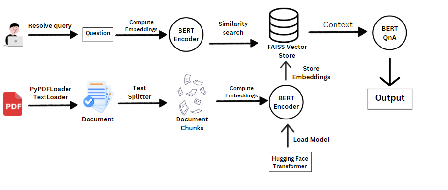

# DocAssist AI

## Overview

PDF-QA-RAG is an advanced question-answering system that leverages the Retrieval-Augmented Generation (RAG) architecture. It takes PDF documents as input, extracts information using BERT for embeddings, stores these embeddings using FAISS, and utilizes BERT-for-QA to generate accurate answers to user queries based on the content of the PDF.

## Key Features
### PDF Processing:

1. Input: Accepts PDF documents containing textual information.
2. Parsing: Extracts and preprocesses text data from PDFs.
3. Embeddings: Utilizes BERT to generate embeddings for text segments.

### Retrieval and Indexing:

1. FAISS Integration: Stores BERT embeddings in FAISS for fast retrieval.
2. Query Expansion: Implements retrieval-augmented techniques for enhanced query responses.

### Question-Answering (QA) Module:

1. BERT-for-QA: Employs fine-tuned BERT models to generate precise answers to user queries.
2. Contextual Understanding: Understands context from the PDF to provide accurate responses.

### User Interface (UI):

1. Streamlit Application: Provides a user-friendly interface for uploading PDFs and querying.


## Architecture

### Overview

The project architecture utilizes the Retrieve and Generate (RAG) framework for question-answering tasks. It combines various components for efficient document retrieval, embeddings, and question-answering capabilities.

### Components

#### Encoder

The Encoder component uses BERT (Bidirectional Encoder Representations from Transformers) for generating embeddings of text documents. These embeddings are stored and indexed using FAISS for efficient retrieval.

#### Decoder

The Decoder component integrates BERT-for-QA (Question Answering) model to generate answers based on retrieved documents and user queries. It utilizes the embeddings generated by the Encoder for context understanding and answer generation.

#### Retriever

The Retriever component uses FAISS, a similarity search library, to efficiently retrieve documents based on query embeddings generated by the Encoder. It facilitates quick document retrieval for the Decoder to generate accurate answers.


### Design Patterns

#### Singleton Design Pattern

The Singleton pattern is employed in components such as the Encoder and Retriever to ensure only one instance exists throughout the application's lifecycle. This ensures efficient resource management and consistent behavior across different parts of the system.

#### Factory Design Pattern

The Factory pattern is used to encapsulate the creation of BERT-based models and their respective tokenizers. This allows flexibility in switching between different BERT configurations while maintaining a unified interface for model instantiation.




### Setup Instructions

1. **Clone the repository:**

   ```bash
   git clone https://github.com/your_username/your_project.git
   cd your_project

2. **Install Dependencies:**
    ```bash
    pip install -r requirements.txt

3. **Run the application:**
    ```bash
    streamlit run app.py

## Conclusion
PDF-QA-RAG represents a culmination of cutting-edge technologies in NLP, providing an effective tool for extracting and understanding textual information from PDFs. It offers a seamless user experience and showcases the application of advanced machine learning models in real-world document processing tasks.